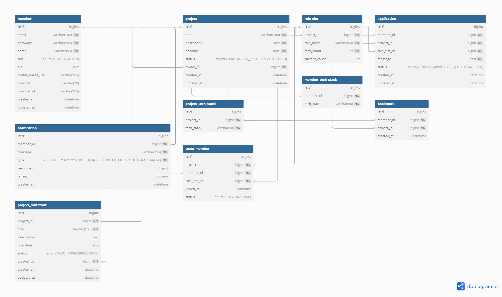

# ERD

### 🧑‍💻 Member (사용자)

| 필드명 | 타입 | 제약조건 | 설명 |
| --- | --- | --- | --- |
| id | BIGINT | PK, Auto Increment | 사용자 ID |
| email | VARCHAR(100) | UNIQUE, NOT NULL, INDEX idx_member_email | 이메일 (로그인 ID) |
| password | VARCHAR(255) | NOT NULL | 암호화된 비밀번호 |
| name | VARCHAR(50) | NOT NULL | 사용자 이름 |
| role | ENUM(MEMBER, ADMIN) | DEFAULT Member | 사용자 역할 |
| bio | TEXT | NULLABLE | 자기소개 |
| profile_image_url | VARCHAR(255) | NULLABLE | 프로필 이미지 URL |
| provider | VARCHAR(20) | NULLABLE | 소셜 로그인 제공자 (ex: GITHUB) |
| provider_id | VARCHAR(255) | NULLABLE | 소셜 로그인 계정 ID |
| created_at | DATETIME | DEFAULT CURRENT_TIMESTAMP | 생성일 |
| updated_at | DATETIME | ON UPDATE CURRENT_TIMESTAMP | 수정일 |
| UNIQUE(provider, provider_id) |  |  | 소셜 로그인 계정 중복 방지 |

### 🧩 Project (프로젝트)

| 필드명 | 타입 | 제약조건 | 설명 |
| --- | --- | --- | --- |
| id | BIGINT | PK, Auto Increment | 프로젝트 ID |
| title | VARCHAR(100) | NOT NULL | 제목 |
| description | TEXT | NOT NULL | 설명 |
| deadline | DATE | NOT NULL, INDEX idx_project_deadline | 모집 마감일 |
| status | ENUM(RECRUITING, IN_PROGRESS, COMPLETED) | DEFAULT RECRUITING, INDEX idx_project_status | 상태 |
| owner_id | BIGINT | FK → Member(id) | 작성자 ID |
| created_at | DATETIME | DEFAULT CURRENT_TIMESTAMP | 생성일 |
| updated_at | DATETIME | ON UPDATE CURRENT_TIMESTAMP | 수정일 |

### 🧠 RoleSlot (역할별 모집 슬롯)

| 필드명 | 타입 | 제약조건 | 설명 |
| --- | --- | --- | --- |
| id | BIGINT | PK, Auto Increment | 역할 슬롯 ID |
| project_id | BIGINT | FK → Project(id) | 프로젝트 ID |
| role_name | VARCHAR(50) | NOT NULL | 역할 이름 (ex: 백엔드, 프론트엔드) |
| max_count | INT | NOT NULL | 모집 인원 |
| current_count | INT | DEFAULT 0 | 현재 승인된 인원 수 |
| created_at | DATETIME | DEFAULT CURRENT_TIMESTAMP | 생성일 |
| updated_at | DATETIME | ON UPDATE CURRENT_TIMESTAMP | 수정일 |
| INDEX idx_role_project (project_id, role_name) |  |  | 복합 인덱스 |

### 📄 Application (지원서)

| 필드명 | 타입 | 제약조건 | 설명 |
| --- | --- | --- | --- |
| id | BIGINT | PK, Auto Increment | 지원서 ID |
| Member_id | BIGINT | FK → Member(id) | 지원자 ID |
| project_id | BIGINT | FK → Project(id) | 지원한 프로젝트 ID |
| role_slot_id | BIGINT | FK → RoleSlot(id) | 지원한 역할 슬롯 ID |
| message | TEXT | NOT NULL | 지원 메시지 |
| status | ENUM(PENDING, APPROVED, REJECTED, CANCELED) | DEFAULT PENDING, INDEX idx_application_status | 지원 상태 |
| created_at | DATETIME | DEFAULT CURRENT_TIMESTAMP | 생성일 |
| updated_at | DATETIME | ON UPDATE CURRENT_TIMESTAMP | 수정일 |
| UNIQUE(Member_id, project_id) |  |  | 중복 지원 방지 |

### 🔔 Notification (알림)

| 필드명 | 타입 | 제약조건 | 설명 |
| --- | --- | --- | --- |
| id | BIGINT | PK, Auto Increment | 알림 ID |
| Member_id | BIGINT | FK → Member(id), INDEX idx_notification_Member_read (Member_id, is_read) | 수신자 ID |
| message | VARCHAR(255) | NOT NULL | 알림 내용 |
| type | ENUM(APPLY, APPROVE, REJECT, PROJECT_UPDATE, MILESTONE, TEAM_CHANGE) | NOT NULL | 알림 유형 |
| resource_id | BIGINT | NULLABLE | 연관 리소스 ID (ex. 프로젝트, 지원서 등) |
| is_read | BOOLEAN | DEFAULT FALSE | 읽음 여부 |
| created_at | DATETIME | DEFAULT CURRENT_TIMESTAMP | 생성일 |
| updated_at | DATETIME | ON UPDATE CURRENT_TIMESTAMP | 수정일 |

### 🏷️ ProjectTechStack (프로젝트 기술 스택 매핑)

| 필드명 | 타입 | 제약조건 | 설명 |
| --- | --- | --- | --- |
| id | BIGINT | PK, Auto Increment | 식별자 |
| project_id | BIGINT | FK → Project(id), NOT NULL | 프로젝트 ID |
| tech_stack | VARCHAR(50) | NOT NULL | 기술 태그 |
| created_at | DATETIME | DEFAULT CURRENT_TIMESTAMP | 생성일 |
| updated_at | DATETIME | ON UPDATE CURRENT_TIMESTAMP | 수정일 |
| UNIQUE(project_id, tech_stack) |  | 기술 태그 중복 방지 |  |

### 🎯 MemberTechStack (사용자 기술 스택 매핑)

| 필드명 | 타입 | 제약조건 | 설명 |
| --- | --- | --- | --- |
| id | BIGINT | PK, Auto Increment | 식별자 |
| member_id | BIGINT | FK → Member(id), NOT NULL | 사용자 ID |
| tech_stack | VARCHAR(50) | NOT NULL | 기술 태그 |
| created_at | DATETIME | DEFAULT CURRENT_TIMESTAMP | 생성일 |
| updated_at | DATETIME | ON UPDATE CURRENT_TIMESTAMP | 수정일 |
| UNIQUE(member_id, tech_stack) |  | 기술 태그 중복 방지 |  |

### ⭐ Bookmark (즐겨찾기)

| 필드명 | 타입 | 제약조건 | 설명 |
| --- | --- | --- | --- |
| id | BIGINT | PK, Auto Increment | 즐겨찾기 ID |
| Member_id | BIGINT | FK → Member(id) | 사용자 ID |
| project_id | BIGINT | FK → Project(id) | 프로젝트 ID |
| created_at | DATETIME | DEFAULT CURRENT_TIMESTAMP | 생성일 |
| updated_at | DATETIME | ON UPDATE CURRENT_TIMESTAMP | 수정일 |
| UNIQUE(Member_id, project_id) |  |  | 중복 즐겨찾기 방지 |

### 📊 ProjectMilestone (마일스톤 / 진행 상황)

| 필드명 | 타입 | 제약조건 | 설명 |
| --- | --- | --- | --- |
| id | BIGINT | PK, Auto Increment | 마일스톤 ID |
| project_id | BIGINT | FK → Project(id) | 프로젝트 ID |
| title | VARCHAR(100) | NOT NULL | 마일스톤 제목 |
| description | TEXT | NULLABLE | 상세 설명 |
| due_date | DATE | NULLABLE | 목표 일자 |
| status | ENUM(TODO, IN_PROGRESS, DONE) | DEFAULT TODO | 상태 |
| created_by | BIGINT | FK → Member(id) | 생성자 ID |
| created_at | DATETIME | DEFAULT CURRENT_TIMESTAMP | 생성일 |
| updated_at | DATETIME | ON UPDATE CURRENT_TIMESTAMP | 수정일 |

### 👥 TeamMember (승인된 팀원)

| 필드명 | 타입 | 제약조건 | 설명 |
| --- | --- | --- | --- |
| id | BIGINT | PK, Auto Increment | 팀원 ID |
| project_id | BIGINT | FK → Project(id) | 프로젝트 ID |
| Member_id | BIGINT | FK → Member(id) | 사용자 ID |
| role_slot_id | BIGINT | FK → RoleSlot(id) | 역할 슬롯 ID |
| joined_at | DATETIME | DEFAULT CURRENT_TIMESTAMP | 참여일 |
| status | ENUM(ACTIVE, INACTIVE) | DEFAULT ACTIVE | 팀원 상태 |
| created_at | DATETIME | DEFAULT CURRENT_TIMESTAMP | 생성일 |
| updated_at | DATETIME | ON UPDATE CURRENT_TIMESTAMP | 수정일 |
| UNIQUE(project_id, Member_id) |  |  | 프로젝트 중복 참여 방지 |

---